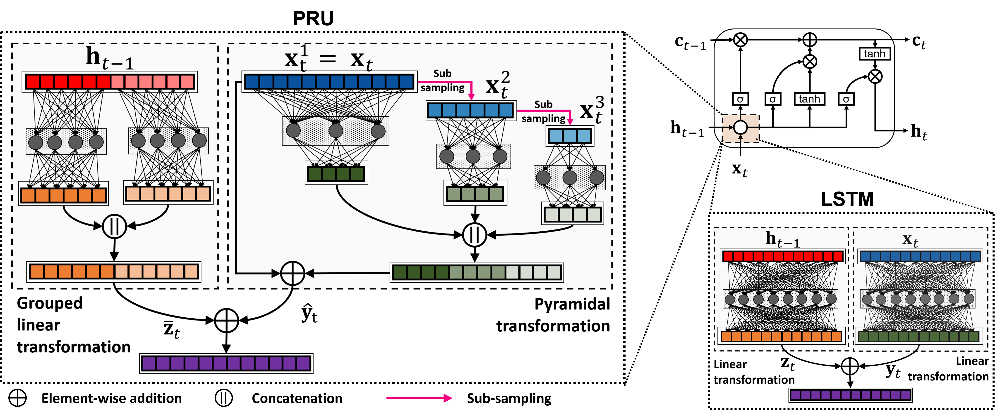

# Pyramidal Recurrent Units (PRU) for Language Modeling

This repository contains the source code of our paper, Pyramidal Recurrent units for language modeling, which is accepted for publication at [EMNLP'18](http://emnlp2018.org/).

**NOTE**: Though we tested our module (PRU) on a highly competitive task of language modeling, our module can be generic enough and can be used for different applications where RNNs (such as LSTMs and GRUs) are currently used, such as question answering, text classification, and machine translation.

## Block diagram of PRU



## Downloading Language Modeling Datasets
You can download the dataset by running the following script
```
bash getdata.sh
```
This script will download the data and place in directory named **data**.

## Training PRU on the PenTree dataset
You can train PRU on the PenTree dataset (or PTB) by using following command:

```
CUDA_VISIBLE_DEVICES=0 python main.py --model PRU --g 4 --k 2 --emsize 400 --nhid 1400 --data ./data/penn 
``` 
where 
```
 --model specifies the recurrent unit (either LSTM or PRU)
 --g specifies the number of groups to be used in the grouped linear transformation, 
 --k species the number of pyramidal levels in the pyramidal transformation
 --emsize specifies the embedding layer size
 --nhid specifies the hidden layer size 
 --data specifies the location of the data.
```
Please see **main.py** for details about other supported command line arguments.

If you want to train language model using LSTM on PTB dataset, then you can do it by using the following command:
```
CUDA_VISIBLE_DEVICES=0 python main.py --model LSTM --emsize 400 --nhid 1000 --data ./data/penn
```

**NOTE:** Our implementation currently supports training on single GPU. However, you can easily update it to support multiple
GPUs by using DataParallel module in PyTorch.

## Testing PRU on the PenTree dataset
You can test the models using following command
```
CUDA_VISIBLE_DEVICES=0 python test.py --model PRU --g 4 --k 2 --emsize 400 --nhid 1400 --data ./data/penn --weightFile <trained model file>
```
Please see **test.py** for details about command line arguments.

## Results and pretrained models
With standard dropout, our model achieves following results on the PTB dataset.

| Model | g | k | emsize | nhid | # Params | Perplexity (val) | Perplexity (test) | Model Size (in MB) | Model Link | 
| -- | -- | -- | -- | -- | -- | -- | -- | -- | -- |
| LSTM | NA | NA | 400 | 1000 | 19.87 | 67.8 | 66.05 | 159 | [Link](https://drive.google.com/open?id=1FzhY03OlBQpLKwTIfMFcQVfwPYDfXO1I) |
| LSTM | NA | NA | 400 | 1200 | 25.79 | 69.29 | 67.17 | 206 | [Link](https://drive.google.com/open?id=1NquUJTUOewyso7BfcpW6mHqYh1GvlBDI) |
| LSTM | NA | NA | 400 | 1400 | 32.68 | 70.23 | 68.32 | 261 | [Link](https://drive.google.com/open?id=1nD8fnruUrO3WhMSsWU4P9zswnXy59n8T) |
| -- | -- | -- | -- | -- | -- | -- | -- | -- | -- |
| PRU | 1 | 2 | 400 | 1000 | 18.97 | 69.99 | 68.06 | 151 | [Link](https://drive.google.com/open?id=1pAWz6ZQDTJc0C3bWNBxeQJ0DREo9EZqo) |
| PRU | 2 | 2 | 400 | 1200 | 18.51 | 66.39 | 64.30 | 148 | [Link](https://drive.google.com/open?id=1rMBQio3nITbCgPhMkgw9Kev0gVDBBS6M) |
| PRU | 4 | 2 | 400 | 1400 | 18.90 | **64.40** | **62.62** | 151 | [Link](https://drive.google.com/open?id=1h2f3-tD7AJhmWNX-p5qMdXjaVfVd0usF) |

With advanced dropouts such as weight dropout, PRU achieves s perplexity of 56.56 on the PenTree dataset while learning only 19 million parameters. See our paper for more details.

## Pre-requisite
To run this code, you need to have following libraries:
* [PyTorch](http://pytorch.org/) - We tested with v0.3.0
* Python - We tested our code with Pythonv3. If you are using Python v2, please feel free to make necessary changes to the code. 

We recommend to use [Anaconda](https://conda.io/docs/user-guide/install/linux.html). We have tested our code on Ubuntu 16.04.

## Acknowledgements

A large portion of this repo is borrowed from [AWD-LSTM](https://github.com/salesforce/awd-lstm-lm) repository.

## Citation
If PRU is useful for your research, then please cite our paper.
```
@inproceedings{mehta2018pru,
  title={Pyramidal Recurrent Unit for Language Modeling},
  author={Sachin Mehta, Rik Koncel-Kedziorski, Mohammad Rastegari, and Hannaneh Hajishirzi},
  booktitle={EMNLP},
  year={2018}
}
```

## References

 1. Hochreiter, Sepp, and Jürgen Schmidhuber. "Long short-term memory." Neural computation 9.8 (1997): 1735-1780. 
 2. Merity, Stephen, Nitish Shirish Keskar, and Richard Socher. "Regularizing and optimizing LSTM language models." arXiv preprint arXiv:1708.02182 (2017).
